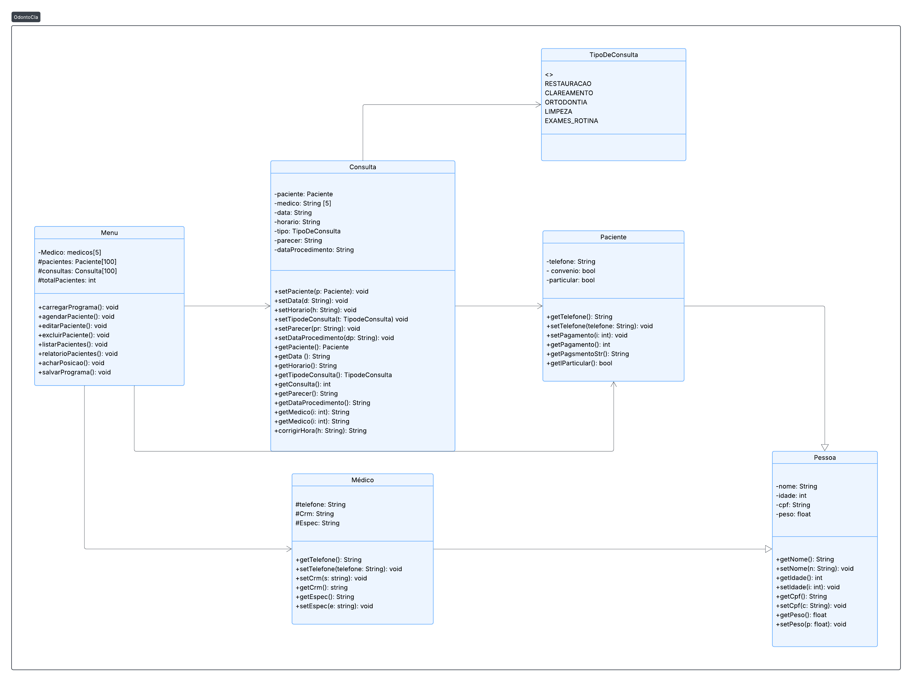

## 🦷 OdontoCIa

OdontoCIa é um sistema desenvolvido em C++ para rodar no terminal.
O objetivo é auxiliar uma clínica odontológica no gerenciamento de agendamentos de pacientes, oferecendo funções de cadastro, listagem, edição, exclusão e relatórios.

---
## Diagrama UML

---

## 📌 Funcionalidades

✅ Agendar Paciente – Inserir informações como:

Nome

CPF

Idade

Peso

Telefone

Data da consulta

Horário da consulta

Método de pagamento

Procedimento

✅ Editar Paciente – Atualizar informações já cadastradas.

✅ Excluir Paciente – Remover um paciente da lista de agendamentos.

✅ Listar Pacientes – Exibir todos os pacientes cadastrados ou apenas um, buscando por seu CPF.

✅ Gerar Relatórios – Produzir relatórios com os agendamentos realizados.

---

## 🛠️ Tecnologias Utilizadas

Linguagem: C++

Entrada/Saída: Terminal (Console Application)

---

## 🚀 Como Executar

Clone o repositório

git clone https://github.com/seuusuario/OdontoCIa.git

--- 

Entre na pasta do projeto

cd OdontoCIa

---

Compile o código

g++ odonto.cpp -o odonto

---

Execute o programa

./odonto

---